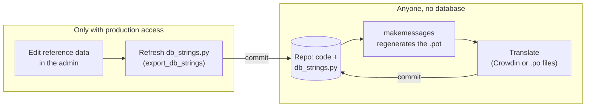

## Volkswagen Type 2 identification

A set of tools to identify VW Type 2 vehicles for model years 1968 to 1979.

https://vw-type2-id.xyz/

Developed with:
- [Django](https://www.djangoproject.com/)
- [Python 3](https://python.org)
- [Bootstrap](https://getbootstrap.com/)

### M-plate decoder

The main app on the site: decode the [M-plate](https://vw-type2-id.xyz/mplate/) and find production data for your bus. 

https://vw-type2-id.xyz/mplate/decode/

#### Local development

Local development is done in a Python virtual environment. To get started:

1. Clone this repository
1. `cd vw-type2-id`
1. `python3 -m venv .venv && . .venv/bin/activate`
1. Install project dependencies => `pip install -r requirements-dev.txt`
1. You should be all set for development in this virtual environment. Use the django management commands to run and manage your app. E.g. `python ./manage.py runserver` to start the server.

#### Translations

Translatable strings come from two places: the code and templates, and the reference data (M-code descriptions, colours, countries, engines and gearboxes), which lives in the production database. The reference data strings are exported to `mplate_decoder/db_strings.py`, which is committed, so the translation catalogs can be regenerated without a database.

**For admins with database access**
- After editing the reference data: with the full reference data loaded, run `python manage.py export_db_strings`, commit `db_strings.py` and regenerate the catalogs as per the instructions below.
- Don't edit `db_strings.py` by hand.

**For developers**
- Regenerate the catalogs (no database needed):
  `make messages` updates `vw_type2_id/locale/django.pot` and the `.po` files. Then run `python manage.py compilemessages`.
- Commit the updated .pot with the code change that adds or changes a string. CI fails if the committed .pot is out of date.

