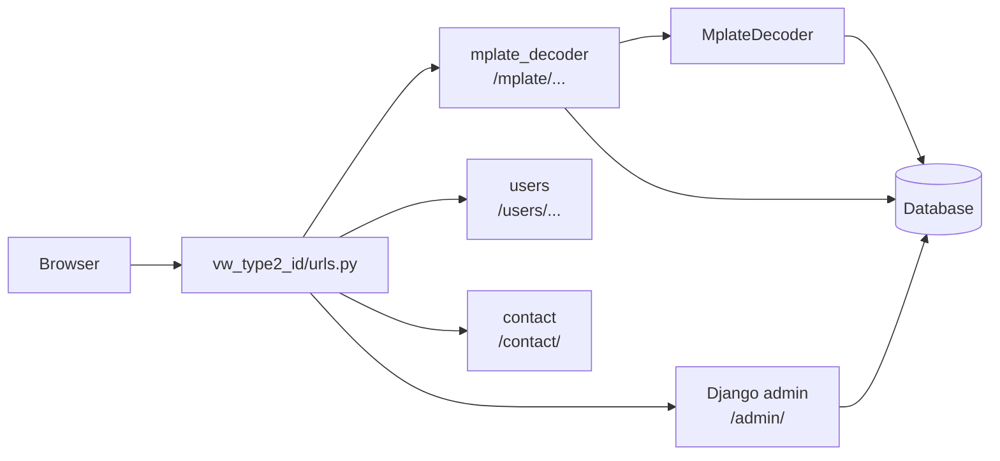
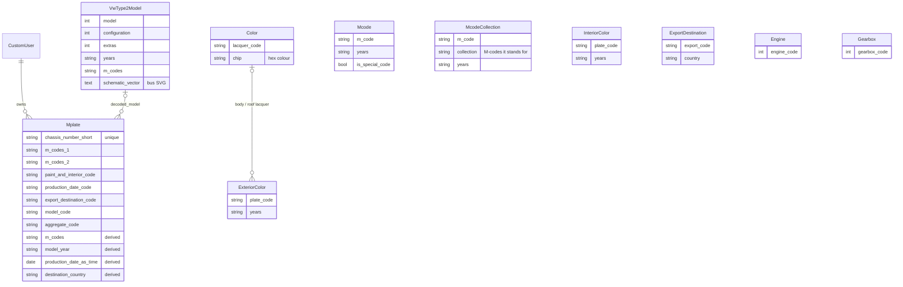
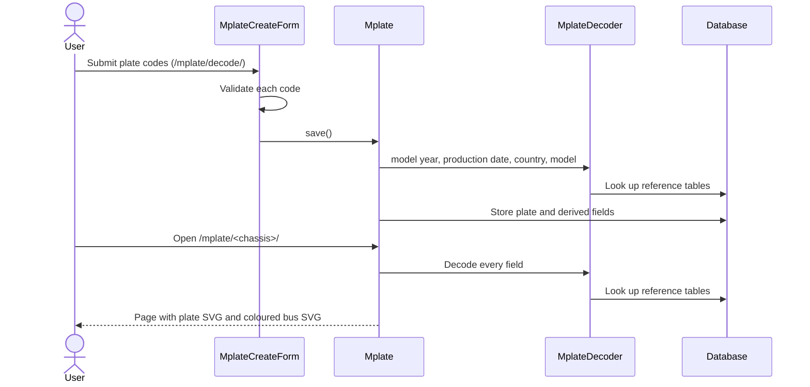

# Architecture

VW Type 2 ID is a single Django project, `vw_type2_id`, rendered on the
server with Bootstrap 4 templates. There is no API and no JavaScript
framework.

## Code structure

| Directory | What it holds |
|---|---|
| `vw_type2_id/` | Project settings, root URLs, `/health/`, `robots.txt`, sitemaps, site-wide templates and the translation catalogs (`locale/`) |
| `mplate_decoder/` | The M-plate decoder: models, the decoding logic, views, forms, templates, plate and bus SVG images, management commands and the tests |
| `users/` | `CustomUser` (Django's user with no extra fields) and the sign-up view |
| `contact/` | The contact form, which sends one email |
| `engine_decoder/` | An empty placeholder, not installed |

## Domain

An M-plate is the production plate fitted to every VW Type 2 built from
model year 1968 to 1979. Its codes say how the bus was built: chassis
number, model, optional extras (M-codes), paint and interior, planned
production date, export destination, and engine and gearbox.

Users submit a plate's codes through a form. The site stores them as an
`Mplate`, decodes them, and shows the result on the plate's own page, with
an image of the plate and a coloured drawing of the bus.

## Data model

There are two kinds of data:

- **Plate submissions** (`Mplate`): the codes users enter, one row per
  plate, keyed by the shortened chassis number. Each plate belongs to the
  user who submitted it, if they were signed in.
- **Reference data**: the lookup tables that give the codes a meaning. They
  are edited in the Django admin and are not in this repository; the tests
  use small fixtures instead (`mplate_decoder/fixtures/tst_*.json`).

Apart from `Mplate.decoded_model` and the two lacquer links on
`ExteriorColor`, the tables are not linked by foreign keys. The decoder
joins them by code at request time: a plate's M-codes match `Mcode.m_code`,
its paint code matches `ExteriorColor.plate_code`, and so on. Many lookups
also filter on the `years` text field, because the same code can mean
different things in different model years.

## Decoding

All decoding lives in `MplateDecoder` (`mplate_decoder/models.py`). Each
`Mplate` has one through its `decoder` property.

| Plate field | Decoded by | Source |
|---|---|---|
| Model year | `decode_model_year` | Chassis number digits, in code |
| Production date | `decode_production_date` | Week code and model year, in code |
| Model, configuration, extras | `decode_model` | `VwType2Model`, matched on model code and year, then on M-codes when that is ambiguous |
| M-codes | `decode_mcodes` | `McodeCollection` expands a code into several, then `Mcode` describes each |
| Exterior colour | `decode_exteriorcolor` | `ExteriorColor`, then `Color` for the colour chips |
| Interior colour | `Mplate.describe_interiorcolor` | `InteriorColor` |
| Export destination | `decode_export_destination` | `ExportDestination` |
| Engine and gearbox | `Mplate.get_engine`, `get_gearbox` | `Engine`, `Gearbox`, from the two aggregate code digits |

`Mplate.save()` stores a few results so that lists, search and the metrics
page don't have to decode every plate again: the joined M-codes, the model
year, the production date, the destination country (in English) and the
decoded model.

## Pages

| URL | View | Purpose |
|---|---|---|
| `/mplate/` | `MplateIndex` | The seven latest plates and the total count |
| `/mplate/decode/` | `MplateCreate` | Submit a plate |
| `/mplate/<chassis>/` | `MplateRetrieve` | The decoded plate, with the plate and bus images |
| `/mplate/<chassis>/update/`, `/delete/` | `MplateUpdate`, `MplateDelete` | Edit or delete your own plates (signed in; staff can change any) |
| `/mplate/mine/` | `MplatesByUserListView` | Your plates |
| `/mplate/search/` | `SearchResultsView` | Search by M-code or by `field:value` |
| `/mplate/metrics/` | `MetricsView` | Charts of models, years, colours, countries and submissions |
| `/mplate/about/` | `MplateAbout` | About the site: where the data comes from, privacy policy and disclaimer |

The plate and bus images are SVG files. The views fill them in with
[lxml](https://lxml.de/): the plate template gets the plate's codes, and
the model's `schematic_vector` gets the body and roof colours.

## Translations

Interface strings and reference data strings are translated with Django's
standard catalogs. See [translations.md](translations.md).
