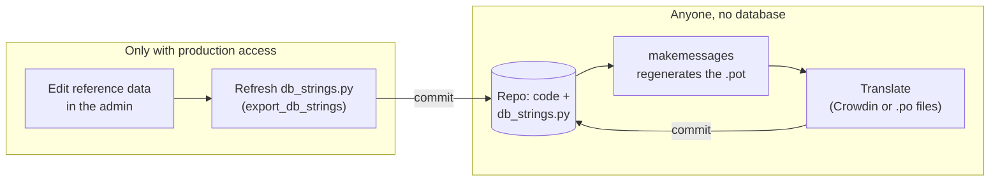

# Translations

Translatable strings come from two places: the code and templates, and the reference data (M-code descriptions, colours, countries, engines and gearboxes), which lives in the production database. The reference data strings are exported to `mplate_decoder/db_strings.py`, which is committed, so the translation catalogs can be regenerated without a database.

## For admins with database access
- After editing the reference data: save a dump of the production reference data as `mplate_decoder/fixtures/mplate_reference.json`, run `make db-strings` and commit `db_strings.py` and the catalogs. The rule loads the dump into your development database.
- Don't edit `db_strings.py` by hand.

## For developers
- Regenerate the catalogs (no database needed):
  `make messages` updates `vw_type2_id/locale/django.pot` and the `.po` files. Then run `python manage.py compilemessages`.
- Commit the updated .pot with the code change that adds or changes a string. CI fails if the committed .pot is out of date.

## Optional: update the catalogs on every commit

[pre-commit](https://pre-commit.com) can run `make messages` before each commit, so you don't have to remember it. It comes with the development dependencies; to enable it, run `pre-commit install` once per clone, with the virtual environment active.

From then on, when a commit touches code or templates and the catalogs change, the commit stops. Add the catalogs with `git add vw_type2_id/locale` and commit again. Commit with the virtual environment active and `DJANGO_VW_TYPE2_ID_SECRET_KEY` set, as for any management command. To skip the hook for one commit, use `git commit --no-verify`.
